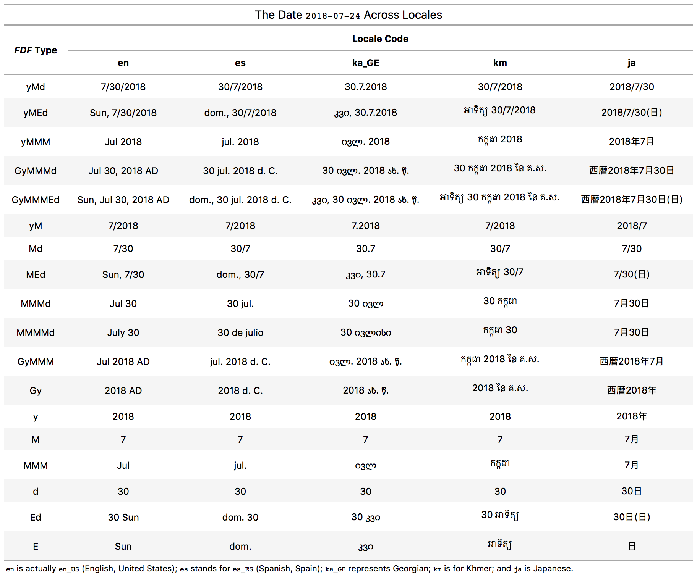

<!-- README.md is generated from README.Rmd. Please edit that file -->

```{r setup, include = FALSE}
knitr::opts_chunk$set(
  collapse = TRUE,
  comment = "#>",
  fig.path = "man/figures/README-",
  out.width = "100%"
)
```

```{r load_packages, include=FALSE}
library(i18n)
```


# i18n

The goal of i18n is to simply get localized variants of dates, times, currencies, and other stuff that can be localized with some degree of precision.

## Some Examples

Here is a date-time string that's all ISO 8601:2004: `2018-07-30T22:40:43-07:00`. Let's take that as our input going forward.

```{r input}
input <- "2018-07-30T22:40:43-07:00"
```

There are standardized date forms across all locales. They come in 4 flavors: `short`, `medium`, `long`, or `full`. Let's just get that date-time into the first two, with random locales:

```{r short_en}
input %>%
  dt_format_standard(
    locale = "en",
    width = "short")
```

```{r medium_de}
input %>%
  dt_format_standard(
    locale = "de",
    width = "medium")
```

We can also apply a smattering of different simple date format presets to this input. The `format_w_pattern()` function is useful for this. We can choose to keep the date portion, the time portion, or both.

```{r format_w_pattern_es}
input %>%
  format_w_pattern(
    date_format = fdf("yMd"),
    time_format = NULL,
    locale = "es")
```

Here is a comparison table of localized dates for all the presets available in the flexible date format:



## Installation

You can install i18n if you dare from GitHub. Use:

``` r
devtools::install_github("rich-iannone/i18n")
```

## Code of Conduct

Please note that this project is released with a [Contributor Code of Conduct](CODE_OF_CONDUCT.md). By participating in this project you agree to abide by its terms.

## License

MIT &copy; Richard Iannone
